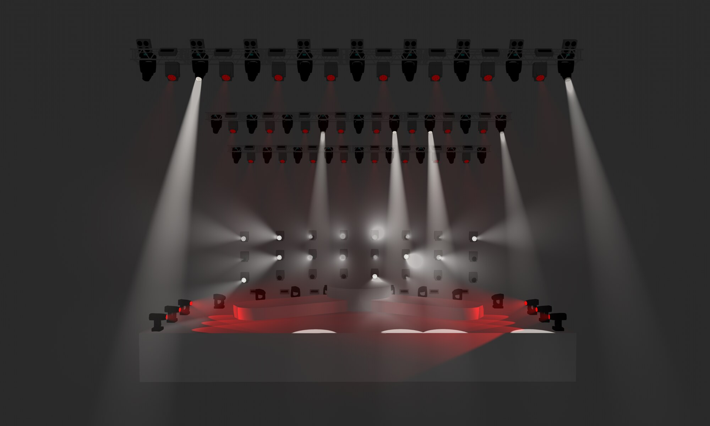
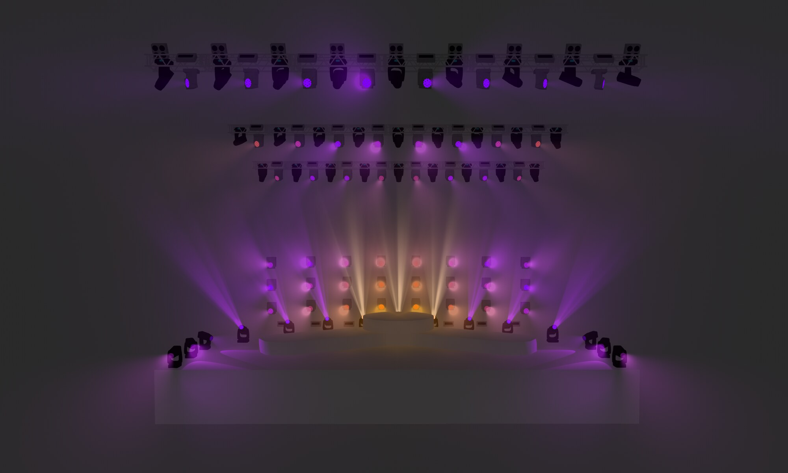
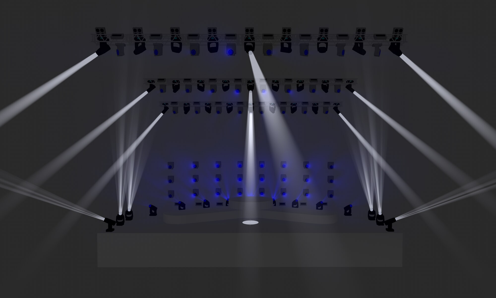

# Learning compositional design rationale from synchronised audio and professional lighting control

**Work in progress · Tobias Wursthorn · HAW Hamburg · September 2026**

[Download the A0 poster (PDF)](poster/preliminary-poster.pdf) · [How the decomposition works](docs/decomposition-method.md) · [wursthorn.org](https://wursthorn.org/) · [Contact](https://wursthorn.org/contact)

## What this project is about

A lighting designer at a concert does much more than flash lights on the beat. A good show has a shape. It holds back in the verse, it saves the first full reveal for the right moment, it brings back a look from the first chorus and changes it slightly in the second. These are design decisions. None of them can be read from the control values the lighting console sends to the luminaires, which is exactly the data most music-to-light systems learn from.

This project works with the show files themselves. Professional designers programmed shows for real songs on a grandMA3 lighting console, and each show file keeps what they authored. That includes cues, presets, effects and the reusable building blocks each cue refers to. The project first takes these shows apart into layers, from the arc of the whole song down to single accents. It then asks whether a model can generate the same kind of layered structure for songs it has never seen. Because the result is organised in layers, a user should be able to regenerate one layer or one part of the song while everything else stays as it was.

## What exists today

**Decomposition of 101 authored shows.** A decomposition of all 101 show records recovers maintained looks, animated layers, accent events, recurrences and the order in which each show develops. Where the console output cannot be proven, or a reaction stays unresolved, the uncertainty is recorded rather than guessed. The records come from five professional designers working with one shared rig and a common template.

| Count | What is counted |
|---:|---|
| 101 | Show records. Some records share the same song, so this is not 101 different songs. |
| 1,338 | Sections across all records |
| 3,164 | Main cues that change the look |
| 12,765 | Accent events |
| 569 | Recurrence families within shows |

These numbers are counting units. They are not independent training examples.

**A first prototype.** Because the decomposition makes the structure of an authored show explicit, a donor show can be transferred onto new audio. The prototype picks a donor show, fits its structure to the new song and writes an editable show for the console. The pictures below come from that prototype, seen in the grandMA3 3D visualiser. The musical review of these shows is still ongoing.

| | |
|---|---|
|  |  |
| **Digitalism, Pogo.** A new song. The corpus has no authored show for it. | **Justice, Genesis.** The corpus also holds a designer's own show for this song, so this is not an example of a new song. The prototype transferred a different donor show. |

The top image shows **Billie Eilish, bad guy**, which is also a new song with no authored show in the corpus.

**A proposed learned generator.** This is the next step and has no results yet. Three model families are candidates. The first is one masked model for all layers. The second plans the upper layers first and then realises the details. The third is a cascade of small diffusion models. A small matched pilot will choose between them.

## The research question

Can a hierarchy-aware audio-conditioned model generate an addressable, layered representation of professional concert-lighting structure and console semantics for unseen songs, within a fixed production environment, such that selected layers or temporal fractions can be regenerated while protected content stays stable?

Four hypotheses follow from this question. Each is tested separately.

- **H1 Representational adequacy.** Authored shows are encoded into the smaller layered representation and rebuilt from it.
- **H2 Predictive adequacy.** The representation is generated from an unseen song's audio, musical structure and context.
- **H3 Hierarchy utility.** Predicting each layer from the layers it depends on beats equally sized flat and collapsed models.
- **H4 Intervention integrity.** A selected layer or time region is regenerated while everything declared as protected stays unchanged.

"Unseen" means that no recording of the same musical work is used for training.

## What is not claimed

The designers' actual reasons. Artistic merit. Acceptance and usefulness for practitioners. Generalisation beyond these five designers and this one rig.

## What is in this repository

- [The A0 poster](poster/preliminary-poster.pdf), work in progress.
- [A plain description of the decomposition](docs/decomposition-method.md).
- Three visualiser images from the current prototype.

The show files, the decomposition software and the internal research notes are private and not included. A later release of documentation, configurations and synthetic examples is planned. No date is promised.

## Contact

Tobias Wursthorn, CEADS Research School, HAW Hamburg. Visit [wursthorn.org](https://wursthorn.org/) or use the [contact page](https://wursthorn.org/contact).
